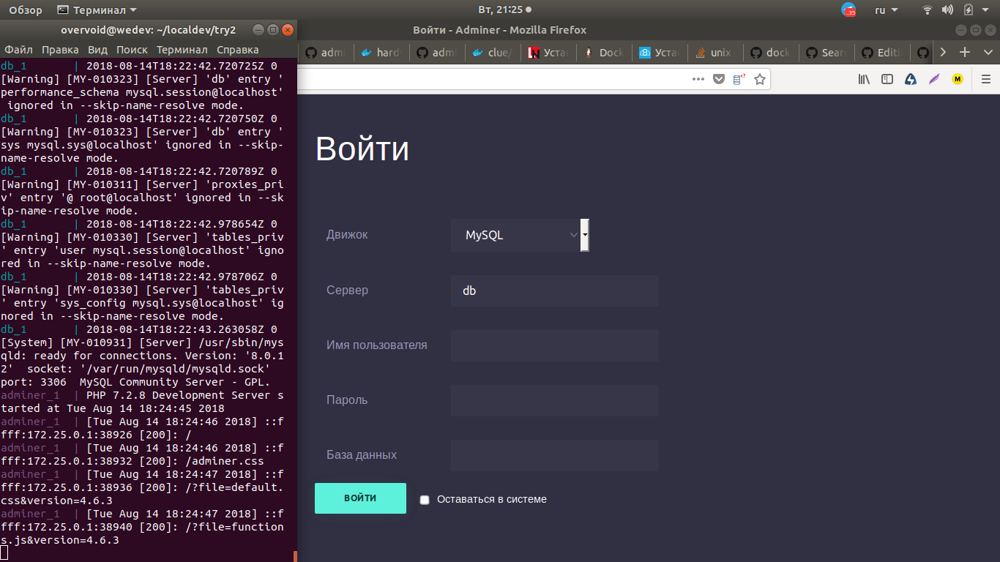
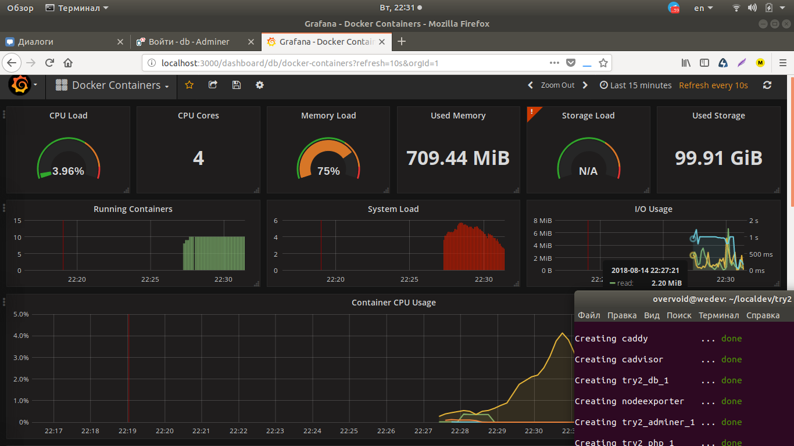

# DDP(DockerDeveloperPack)
## run: 
```php
 chmod +x dev //даем права на исполнение баш скрипта dev
 ./dev one
 ./dev start
 ```
## legend:
> one - используйте в первый раз, правильная настройка групп и контейнеров(потребует пароль sudo)
> try - попробовать произвести настройку без sudo(скорее всего не сможет добавить группы)
> start - запустит проект
> stop - усыпит и остановит все контейнеры проекта

### DarkAdminer


### MonitorSystem


